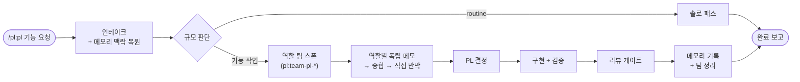
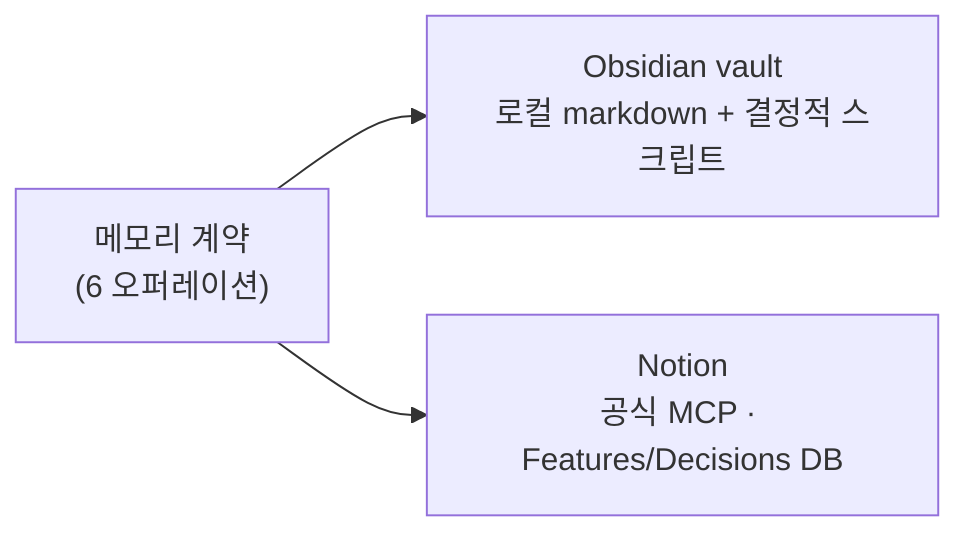

<div align="center">

# pl

**`/pl:pl`(Claude Code) 또는 `$pl`(Codex CLI) 한 번으로 역할 에이전트 팀이 토론하고, 구현하고, 검증하고, 결정을 기억합니다**


</div>

---

PL/테크리드 오케스트레이션 플러그인입니다. 기능 요청을 받으면 리드(PL)가 역할 에이전트 팀을 구성해 구조화된 토론을 거쳐 결정하고, 구현·검증 후 결과와 결정을 **선택한 메모리 백엔드(Obsidian vault / Notion)** 에 기록합니다. 다음 작업에서 그 기억이 자동으로 복원됩니다.

## 워크플로우



기록은 백엔드 중립 계약(맥락 복원 → 작업공간 확인 → feature 노트 → 원장 갱신 → 결정 기록 → 무결성 점검)으로 동작하고, 실제 저장은 어댑터가 담당합니다:



## 설치

> **전제조건**: macOS/Linux + `python3` 3.10 이상 (Obsidian 백엔드 헬퍼가 Unix 전용 잠금 `fcntl`을 사용합니다. Windows 미지원) + `jq` ([안전 훅](#안전-훅)이 도구 호출 페이로드를 읽는 데 씁니다 — 없으면 훅이 **조용히 비활성**됩니다. macOS: `brew install jq`). 호스트는 Claude Code 또는 Codex CLI 0.153 이상. 마켓플레이스 접근 조건은 [루트 README](../../README.md#설치) 참조.

**Claude Code**

```
/plugin marketplace add zz1996zz/agent-plugins
/plugin install pl@zz1996zz
```

**Codex CLI**

```
codex plugin marketplace add zz1996zz/agent-plugins
codex plugin add pl@zz1996zz
bash ~/.codex/plugins/cache/zz1996zz/pl/*/install-codex.sh
```

세 번째 줄이 필요한 이유: Codex 플러그인은 skills·hooks는 번들하지만 역할 에이전트 정의는 번들하지 못합니다 ([openai/codex#18988](https://github.com/openai/codex/issues/18988)). `install-codex.sh`가 `agents/codex/*.toml`을 `~/.codex/agents/`에 복사합니다. 이슈가 닫히면 이 단계는 사라집니다. 훅이 발동하지 않으면 `~/.codex/config.toml`에 `[features] hooks = true`를 확인하세요.

## 사용

```
/pl:pl <기능 요청>        (Claude Code)
$pl <기능 요청>           (Codex CLI)
```

예: `/pl:pl 주문 취소 API에 부분 취소 지원 추가`

- routine한 요청(오탈자 점검 등)은 솔로 패스로 가볍게 처리됩니다.
- 기능 작업이면 역할 팀 구성 → 토론 → 결정 → 구현 → 검증 → 메모리 기록까지 진행됩니다.
- work 네임스페이스는 **canonical 레포명**(origin remote 기준)으로 정해집니다 — worktree나 워크스페이스 디렉토리 이름에 영향받지 않습니다. 특정 업무로 기록하려면 요청에 업무명을 명시하거나, 레포에 고정하려면 [레포 로컬 설정](#레포-로컬-설정-선택)의 `workNamespace`를 쓰세요.

## 메모리 백엔드 (온보딩 1회)

메모리가 필요한 **최초의 기능 작업**에서 온보딩이 시작됩니다 (routine 요청은 메모리를 쓰지 않으므로 온보딩이 나오지 않습니다).

| 선택지 | 준비물 | 온보딩에서 할 일 |
|---|---|---|
| **Obsidian vault** (로컬 markdown) | 없음 (Obsidian 앱 불필요) | 저장 경로 1개 답하기 |
| **Notion** (공식 MCP, source of truth) | Notion 계정 | 공식 MCP 서버 1회 추가(온보딩이 명령 안내) + `/mcp` OAuth + 메모리 root 페이지 URL 붙여넣기 |

- Notion 선택 시 root 페이지 아래 **Features/Decisions 데이터베이스**와 **Works 페이지**가 자동 생성됩니다.
- 백엔드 변경: `<data-dir>/config.json` 삭제 후 재온보딩 (기존 데이터 이관은 미지원).
- Notion MCP 서버는 플러그인에 동봉되지 않습니다 — Notion 백엔드를 선택했을 때만 온보딩이 추가를 안내합니다. Obsidian만 쓰면 외부 서비스 의존성이 0입니다.
- `config.json`이 유실돼도(재설치·`uninstall` 등) vault가 남아 있으면 다음 실행에서 자동 탐지(`repair`)로 재연결을 제안합니다. Notion 백엔드는 디스크에서 탐지할 수 없어 재온보딩이 필요하며, 기존 데이터베이스는 재사용됩니다.
- Notion 쓰기 실패 시 기록은 `<data-dir>/pending/`에 보존됐다가 다음 실행에서 업서트로 재반영됩니다 — 조용한 유실이 없습니다.
- `<data-dir>`은 Claude Code에서 `${CLAUDE_PLUGIN_DATA}`(= `~/.claude/plugins/data/pl-zz1996zz/`), Codex CLI에서 `~/.codex/plugins/data/pl/` 입니다. 두 호스트를 같은 머신에서 쓰면 온보딩이 각각 한 번씩 일어납니다 — 같은 vault 경로를 답하면 메모리가 공유됩니다 (Obsidian은 두 번째 호스트에서 `repair`가 기존 vault를 자동 제안합니다). Notion 온보딩 명령은 호스트별로 다르며 온보딩이 안내합니다.

## 안전 훅

설치하면 PreToolUse 훅(`hooks/guard.sh`)이 리드와 모든 팀원의 Bash 호출에서 아래를 차단합니다. pl의 안전 경계("되돌릴 수 없는 행동은 사람 손에")를 산문이 아니라 기계적으로 지키기 위한 것입니다.

| 차단 | 예 |
|---|---|
| force-push | `git push --force`, `-f`, `--force-with-lease` |
| hard reset | `git reset --hard` |
| 추적되지 않은 파일 삭제 | `git clean -f`, `-fd` |
| 검사 우회 | `--no-verify`, `git commit -n`, `git -c core.hooksPath=…` |
| 보관·브랜치 강제 삭제 | `git stash drop`/`clear`, `git branch -D` |

- **커밋·push 자체는 막지 않습니다** — 훅은 사용자가 그걸 요청했는지 알 수 없습니다. 막는 것은 어떤 요청에서도 에이전트가 스스로 택하면 안 되는 지름길입니다.
- 해제 옵션은 없습니다. 정말 필요하면 프롬프트에 `! <명령>`으로 직접 실행하세요.
- 인용문 안(커밋 메시지)은 판정에서 제외하고 토큰 단위로 봅니다. `git commit -m "force push 금지"`는 통과합니다.
- Codex CLI에서도 같은 훅이 같은 판정으로 동작합니다 (페이로드·거부 형식이 동일 — `tests/pl-guard/run-unit.sh`의 Codex 케이스로 고정). 프로젝트 훅과 달리 플러그인 훅은 설치로 신뢰됩니다. 다만 실제 세션에서 차단이 발동한 실측은 아직 없습니다.

## 레포 로컬 설정 (선택)

레포에 `.agents/pl.local.md`(권장, 호스트 중립) 또는 `.claude/pl.local.md`(기존)를 두면 매 요청에 반복하던 것을 생략할 수 있습니다. 리드는 이 파일을 읽기만 하고 만들거나 고치지 않습니다.

```markdown
---
workNamespace: billing-core        # 메모리 work 슬러그 (요청에 명시한 이름 > 이 값 > canonical 레포명)
verifyCommands:                    # done 전에 반드시 통과해야 하는 명령
  - ./gradlew test
protectedPaths:                    # 팀원은 절대, 리드는 명시 요청 시에만 편집
  - infra/
  - .github/
---
```

## 호스트 차이

같은 워크플로우지만 호스트가 제공하는 것이 달라서 아래가 다릅니다. 리드는 오케스트레이터의 Platform Behavior 매핑표로 이 차이를 처리합니다.

| | Claude Code | Codex CLI |
|---|---|---|
| 역할 세션 | Agent Teams 팀원 (장기 실행, 상호 메시징) | 서브에이전트 (병렬 스폰, 결과 반환) — `codex exec` 비대화형에서는 스폰 도구가 노출되지 않아 팀 경로가 성립하지 않음 (대화형 세션 전용, 2026-09 실측) |
| 팀원 간 직접 반박 (Round 2) | 팀원끼리 직접 메시지 | 리드가 중개 (재질문 → 답변 전달) |
| 공유 태스크 목록 | 있음 (`TaskList`, 대화형 세션 한정 — 헤드리스는 Execution Ledger) | 없음 — feature 노트 Execution Ledger가 유일한 태스크 상태 |
| 역할별 허용 도구 | 에이전트 `tools` 목록 | 없음 — `sandbox_mode`(read-only / workspace-write)로 근사, 나머지는 역할 본문의 산문 규칙 |
| 역할 정의 설치 | 플러그인에 번들 | `install-codex.sh`로 `~/.codex/agents/`에 복사 |
| 모델 | 프론트매터 `opus`/`sonnet` | `build_codex_agents.py`의 `MODEL_MAP`으로 변환 |
| 진입점 암묵 호출 | `disable-model-invocation`으로 `/pl:pl` 명시 호출만 | description 기반 암묵 호출 허용 (`$pl` 또는 'PL 에이전트로' 요청) |
| 샌드박스 | 해당 없음 | `workspace-write`는 `.git` 쓰기를 막아 커밋 요청이 실패한다 — 커밋까지 맡기려면 샌드박스 설정을 조정 |
| 추천 조합 플러그인 | 아래 표 | 해당 없음 (Claude 마켓플레이스 전용) |

## 추천 조합 (선택)

pl은 단독으로 완결이지만 (Claude Code 한정), 아래 플러그인들과 자연스럽게 합성됩니다. 설치는 각자 선택이고 — **없으면 pl이 자동으로 무시합니다** (조건부 참조라 에러·기능 저하 없음).

| 플러그인 | 합성 효과 |
|---|---|
| `security-guidance` | 편집·커밋 시 자동 보안 경고 훅 — pl 팀원의 구현 편집에도 그대로 적용 |
| `context7` | 라이브러리 버전별 최신 문서 MCP — 설치돼 있으면 리드가 필요 시 활용 |
| `commit-commands` | 커밋 유틸 커맨드 (pl과 직교; auto-push 커맨드는 팀 규칙과 맞는지 확인 후 사용) |
| `claude-md-management` | CLAUDE.md 품질 관리 (pl과 직교) |
| [`codebase-memory-mcp`](https://github.com/DeusData/codebase-memory-mcp) | 코드 지식 그래프 MCP — 설치돼 있으면 리드가 파일 탐색 대신 구조 쿼리를 우선 사용 (설치법은 해당 레포 참조) |
| [`ponytail`](https://github.com/DietrichGebert/ponytail) | 훅 기반 상시 미니멀리즘 모드 (YAGNI·stdlib 우선) — 리드와 팀원 편집 전반에 최소 해법을 강제. 과잉 구현 검출 렌즈는 pl 리뷰어에 내장돼 있어 미설치여도 팀 위임 경로는 동일 |

설치: `/plugin install <이름>@claude-plugins-official` (codebase-memory-mcp·ponytail은 각 링크의 설치법 참조)

## 업데이트

```
/plugin marketplace update zz1996zz
/plugin update pl@zz1996zz
```

Codex CLI: `codex plugin marketplace upgrade` → `codex plugin remove pl@zz1996zz && codex plugin add pl@zz1996zz` (Codex에는 `plugin update` 커맨드가 없어 remove+add로 갱신합니다).

업데이트 시 사용자 데이터(`config.json`·`pending/`)는 보존됩니다. **`uninstall`은 데이터를 삭제하므로** 갱신 용도로 쓰지 마세요 ([루트 README](../../README.md#업데이트) 참조).

## 개발

- 시스템 변경 후 테스트 4종 실행: `skills/team-pl-orchestrator/scripts/`의 `test_pl_config.py` · `test_memory_note.py` · `test_pl_user_config.py` · `test_build_codex_agents.py` (`build_codex_agents.py`와 그 테스트는 `tomllib` 때문에 Python 3.11 이상 — 런타임 헬퍼는 3.10으로 충분)
- 리드 머신 전용 검사를 건너뛰려면: `PL_SKIP_MACHINE_TESTS=1`
- 프롬프트 문서(`SKILL.md`·`references/`·`agents/`)나 `hooks/guard.sh`를 고쳤으면 레포 루트의 행동 테스트도 돌립니다: `tests/pl-guard/run-unit.sh`(훅 판정, 토큰 불필요) · `tests/pl-e2e/run-unit.sh`(E2E 판정 로직, 토큰 불필요) · `tests/pl-e2e/run-safety.sh`(실제 세션, 토큰 소모). 자세한 것은 [`tests/pl-e2e/README.md`](../../tests/pl-e2e/README.md)
- Codex 지원 관련 테스트: `test_build_codex_agents.py` · `build_codex_agents.py --check` (매니페스트·에이전트 변환 검증, 토큰 불필요) · `tests/pl-codex/run-install-unit.sh`(설치 스크립트 단위 테스트, 토큰 불필요) · `tests/pl-e2e/run-safety-codex.sh`(실제 Codex 세션, 토큰 소모)
- `agents/team-pl-*.md`를 고쳤으면 `build_codex_agents.py`로 `agents/codex/`를 재생성해 함께 커밋합니다.
